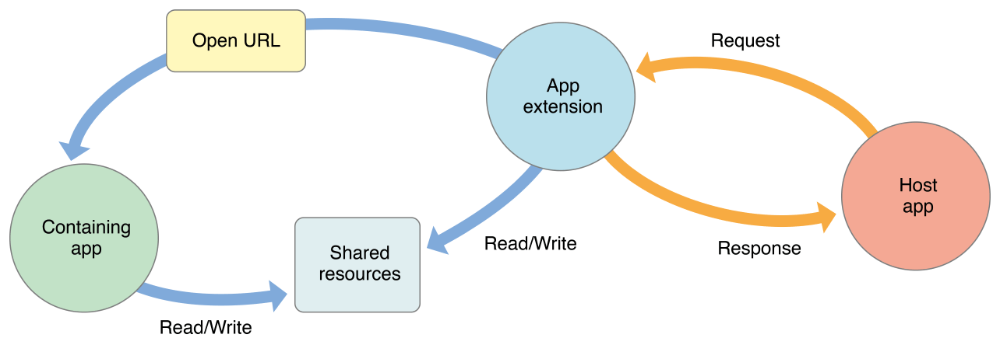
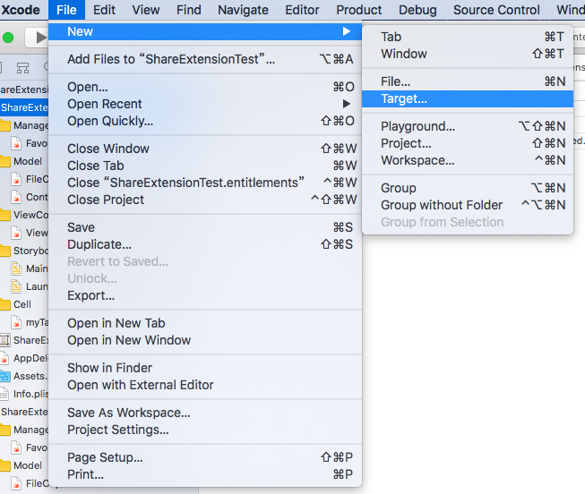
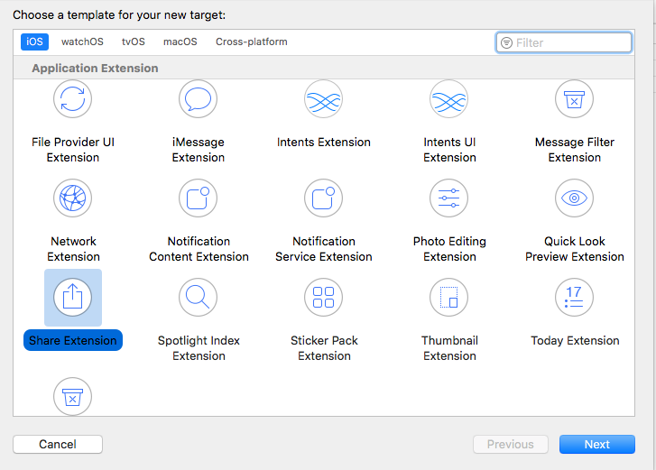

# Share Extension介紹

## Extension介紹

### Extension？

為iOS提供的功能，讓APP之間能夠資料分享

### Extension有哪些類型？

常見的類型如下：

* **Today** Extension
* **Share** Extension
* **Action** Extension etc...

### Extension在App的角色定位？

* Extension是一個App的附加功能，因此，想要有extension功能，必須依附在一個主要的project App底下，而這個被依附的Project App稱之為**Containing app**
* Extension的存在會隨著App的安裝或移除決定

## Share Extension介紹

### 使用情景

一般使用的情況會是使用者想要分享網頁文章或照片到FB、IG上，而開發者就是透過自己定義Share Extension功能，讓使用者也能過分享到自己定義的APP上

### 決定Share Extension出現在分享清單中的關鍵

要看APP允許接受什麼類型的內容，可選擇支援類型如下：

* 可經由share extension自己目錄底下`plist`檔，調整欄位**NSExtension** ➔ **NSExtensionAttributes** 改為**Dictionary** Type ➔ 新增下列欲選取的`key`
  * `NSExtensionActivationSupportsAttachmentsWithMaxCount`
  * `NSExtensionActivationSupportsAttachmentsWithMinCount`
  * `NSExtensionActivationSupportsFileWithMaxCount`
  * `NSExtensionActivationSupportsImageWithMaxCount`
  * `NSExtensionActivationSupportsMovieWithMaxCount`
  * `NSExtensionActivationSupportsText` 
  * `NSExtensionActivationSupportsWebURLWithMaxCount`
  * `NSExtensionActivationSupportsWebPageWithMaxCount`
* EX：若我只想允許接收分享連結的類型，就新增`NSExtensionActivationSupportsWebURLWithMaxCount`屬性並設定其數量

### 提供的預設介面

會有一個預設畫面、一個**Cancel**按鈕、一個**Post**按鈕 

### 由誰來處理其他App傳過來的資料？

* 其他的app端之稱為**Host App**，Host App按下Post之後，**extension**端會把資料取出並傳給**Containing app**做後續如何呈現，而處理端就看要設計放在哪一端
  * extension：接收端
  * Containing App：呈現端 

### 怎麼將資料傳給Containing App

蘋果提供一項叫**App Groups**的服務，允許開發者能夠在自己的App之間傳遞資料，可透過下列三種方式

* `UserDefaults`
* `FileManager`
* `CoreData`

因此，開發者使用哪個指令操作，取資料就需要鍵值或路徑，而這個相對於在APP Group服務底下稱為group name，這也是開發者可以自行定義的

### 建立與啟用App Group

建立Target

選擇Share Extension

建立完後，到Project的左側欄位，選擇**Capabilities**，開啟**App Group**功能，Container App（EX: **ShareExtensionTest**）與extension端（EX: **ShareExtension**）都要啟用。

點選+號，新增自己的group name


取名建議：結尾名稱跟ContainerApp名稱一致，如：`group.XXX.XXX.yourContainerAppName`，否則可能會有未知的錯誤


完成，可以看到XCode工作環境會多一層extension端的目錄。

